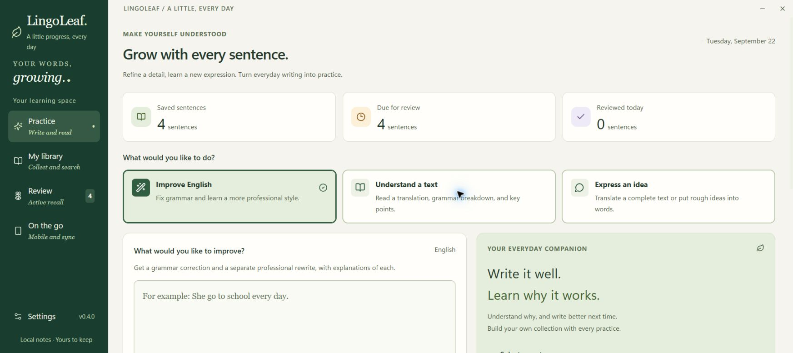
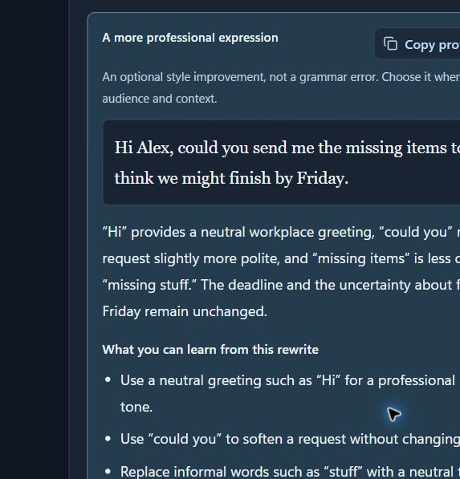
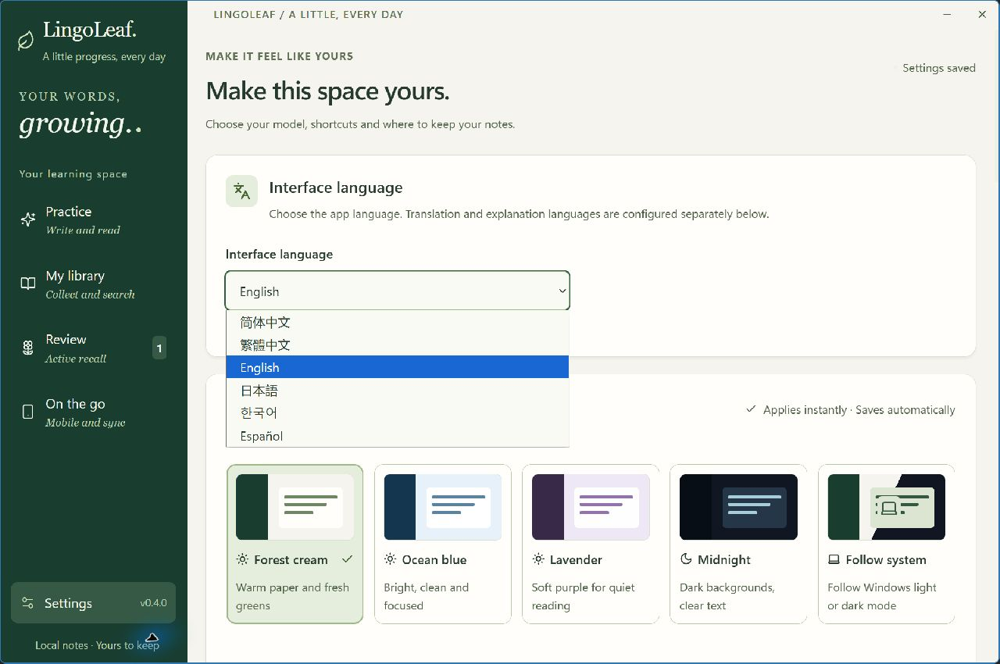
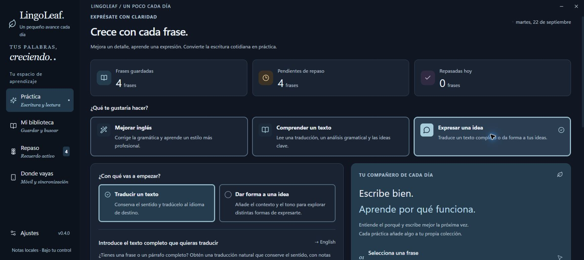

# LingoLeaf · 语叶

**English** | [简体中文](README.zh-CN.md)

**Turn everyday sentences into lasting language skills.**

An English-learning companion for Windows. Select a sentence, check its grammar or translate it with a keyboard shortcut, and turn everyday expressions into your own learning library.



*Screenshots use demonstration text. No personal records or credentials are shown.*

## Everyday use

1. Open Settings (偏好设置), choose OpenAI, an OpenAI-compatible service, Anthropic, Azure OpenAI, or Ollama, and enter your endpoint, model, and API key. Test the connection and save.
2. Select text in another application and press **Ctrl + Shift + G**. A popup shows whether the sentence is grammatically correct, highlights specific errors, and explains the rules with new examples. It also translates the corrected text into your configured explanation language, with a separate copy button for that translation. Style suggestions are labeled separately from grammar errors.
3. Press **Ctrl + Shift + T** to translate the selected text into your configured target language. By default, LingoLeaf replaces the selection when it can verify an editable text range. If the original window or selection has changed, replacement is canceled and you can copy the translation from the result. Both shortcuts are customizable.
4. Search your sentences in the Learning Library. In Review, recall the answer before revealing it, then rate how well you remembered it to schedule your next review.
5. Start a connection under Mobile Sync and scan the QR code with your phone. When both devices are on the same trusted network, mobile review progress is saved directly to the desktop library.

Closing the window minimizes the app to the system tray. Right-click the tray icon to quit completely. LingoLeaf processes text when you trigger a shortcut, submit a practice request, or send a follow-up question; it does not monitor everyday typing.

## Reading, expressing ideas, and follow-up questions

The practice page has three task cards, with a clear selected border and checkmark:

| Mode | What to enter | What you get |
| --- | --- | --- |
| Improve English (修改英文) | An English sentence | Minimal grammar corrections, a meaning translation, and a separate professional/formal version with explanations and reusable writing tips |
| Understand a text (读懂外语) | Text in your target language, such as English | A full translation into your explanation language, source-anchored grammar notes, and key points |
| Express an idea (表达想法) | A complete source text or rough ideas | Choose **Translate a text** for a faithful translation, or **Shape an idea** for suggested wording, alternatives, context/tone controls, and clarification questions |

Translation and idea shaping share one page. Each input mode retains its own draft and result while you switch tasks. The existing global shortcuts still check grammar or translate a complete selection.

For English-to-Chinese reading, set Translation target language to **English** and Explanation language to **简体中文**, then select **Understand a text**.

Professional wording is an optional style improvement, even for grammatically correct input. It has its own copy button and explains what makes the wording more suitable for work or formal communication. The grammar verdict and minimal correction stay separate; applying a grammar correction uses that correction, not the professional version. Existing notes remain readable; analyze again to add a professional version to a new note.



Use the follow-up panel on a result, library note, review answer, or selection popup to ask about an explanation or refine an expression. The model receives that result, your question, and recent conversation turns using the same configured provider. Each result supports up to 20 question-and-answer turns. Long histories remain saved; only recent complete turns within a 48,000-character history budget are sent to the model.

Follow-ups on saved learning entries are stored in the desktop library and separate Markdown conversation notes, and can be read on mobile. A grammatically correct sentence excluded by your save preference has a temporary conversation only; its follow-ups are not added to the library. Every new question is an additional model request. Model suggestions and clarifying questions never replace external text automatically.

## Download and development

Current version: **v0.4.0 preview**. Download the portable Windows x64 executable from [Releases](https://github.com/liuxuan1-1/LingoLeaf/releases), then configure your own model service after launching it. Exit an older running version from its tray menu before opening the new executable.

[](https://github.com/liuxuan1-1/LingoLeaf/actions/workflows/ci.yml)

Requires Windows 10 or 11, x64. The native bridge uses the built-in Windows PowerShell 5.1, .NET Framework, and UI Automation; no additional .NET SDK is required. The desktop app uses Electron with a React + TypeScript interface. Development requires Node.js 22 or later.

```powershell
npm ci
npm run dev
```

Test, build, and package the portable app:

```powershell
npm test
npm run build
npm run package
```

The Windows executable is generated in `release/`. Builds currently do not include code signing. If you distribute your own build, sign it and check security prompts on the target Windows environment before release. Do not commit runtime data or API keys.

## Appearance and readability

Under **Settings → Interface language**, choose **简体中文, 繁體中文, English, 日本語, 한국어, or Español**. The choice applies immediately and saves independently, including open result popups. It does not submit unsaved model settings or change your translation/explanation languages. The mobile learning page follows the desktop interface language when reloaded. Saved sentences, explanations, tags, and personal notes keep their original language.



Under Appearance and Reading (外观与阅读), choose **Forest Cream (松林米白), Sky Blue (晴空蓝白), Lavender (雾紫), or Midnight Dark (午夜深色)**, or follow the Windows light/dark setting. Themes apply to the main interface, forms, learning cards, in-app dialogs, and selection result popups.



Text sizes are **Standard / Large / Extra Large**, with body text baselines of 16 / 18 / 20px. Large is the default. Descriptions, labels, and buttons use their own readable sizes. Smaller windows reflow and scroll to keep actions accessible when text is enlarged.

Text selections use a distinct highlight in every theme. Original text, suggested expressions, and translations retain paragraph breaks, blank lines, and indentation when displayed. Copy and Replace use the original plain text of the result.

Appearance changes take effect immediately and save independently. You do not need to click the model settings' Save button, and unsaved API configuration edits are preserved. Open result popups update as well, and your choices persist after restarting the app. Upgrading preserves your model settings, API keys, and learning library.

## API configuration

| Service | Example endpoint | Model field |
| --- | --- | --- |
| OpenAI | `https://api.openai.com/v1` | A model your account can access |
| OpenAI-compatible | The base URL provided by the service, such as `https://example.com/v1` | The service's model name |
| LM Studio (select OpenAI-compatible) | `http://127.0.0.1:1234/v1` | The name of a locally loaded model |
| Anthropic | `https://api.anthropic.com/v1` | A Claude model your account can access |
| Azure OpenAI | `https://YOUR-RESOURCE.openai.azure.com` | **Deployment name**; the API version is configurable |
| Ollama | `http://127.0.0.1:11434` | A downloaded model name, such as `qwen3:8b` |

OpenAI and OpenAI-compatible services support **Chat Completions / Responses**. In Request Protocol (请求协议), choose Auto or select a protocol explicitly. If your service requires Responses, select Responses and enter its base URL, or enter the full endpoint ending in `/responses`, such as `https://example.com/v1/responses`. Responses supports both JSON and SSE responses.

Anthropic uses Messages, Ollama uses its native `/api/chat` endpoint, and Azure OpenAI uses deployment-based Chat Completions.

Models must follow JSON output instructions. Enter the API key required by your chosen service; local compatible endpoints or Ollama instances that do not require authentication can leave it blank. Model access and billing are managed through your own provider account. LingoLeaf does not include a shared API key.

Remote APIs require HTTPS; local loopback endpoints may use HTTP. Configure HTTPS for remote self-hosted services. API keys are encrypted with Electron `safeStorage` under your Windows user account. Saved plaintext keys are unavailable to the renderer and are not written to Markdown notes, mobile pages, or exports.

Protocol references: [Chat Completions API](https://developers.openai.com/api/reference/resources/chat/subresources/completions/methods/create) · [Responses API](https://developers.openai.com/api/reference/resources/responses/methods/create).

## Learning library and mobile access

Under Settings → Learning notes folder, choose an existing Obsidian vault or a synced folder such as OneDrive. The app creates:

```text
selected-folder/
└─ LingoLeaf/
   ├─ index.md            # Learning index organized by review time
   ├─ entries/
   │  └─ date-UUID.md     # Original sentence, answer, explanation, practice, and personal notes
   └─ conversations/
      └─ entry-UUID-turn-UUID.md  # One immutable follow-up question and answer
```

Individual Markdown notes are not overwritten after creation, so you can add your own annotations. The app updates the index. The desktop `library.json` is the authoritative source for review progress. Syncing the Markdown folder lets you read and annotate notes on your phone, but **Markdown edits are not automatically imported into review progress**. Reviewing through the QR connection writes directly to the same desktop library, avoiding conflicting progress on two devices.

New grammar notes include the corrected text's translation and its explanation language. These are available in the desktop library, Markdown notes, and mobile review. Older notes stay readable; analyze the original text again to create a new note with a translation. Changing your explanation language does not relabel historical translations.

The mobile connection runs only when you enable it. Each restart creates new pairing credentials, and stopping the connection immediately revokes access. The connection uses HTTP over your local network; use it only on a trusted home network. The QR code grants permission to access the library and submit reviews, so do not share it publicly. If Windows Firewall prompts you on first use, decide whether to allow access on private networks. Your computer must stay running. For offline reading or access from another network, use your own file sync tool.

Learning uses transparent spaced repetition: forgotten material returns soon, while remembered material receives gradually longer review intervals. This is a practice schedule, not a precise measurement of memory ability.

## Limitations

- Standard text fields, Notepad, and applications that expose selections through UI Automation can support safe replacement. PDFs, read-only web pages, custom editors, and some terminals may support only extraction or copying. Applications running with higher privileges may be inaccessible.
- Password fields are not read. When there is no selection, old clipboard content is not treated as newly selected text.
- The native bridge prefers UI Automation. When necessary, it temporarily copies the selection while making a best effort to preserve the clipboard. It refuses this fallback for special formats it cannot safely back up. Results are not pasted blindly across applications.
- LLMs can still misunderstand text. Popups retain the original sentence and explanation. You can disable automatic translation replacement in Preferences; editors usually support **Ctrl + Z** to undo a paste.
- The interface and learning library can open before a working model is configured, but translation and grammar checking require a usable API configuration.

## Contributing and license

MIT License. See [CONTRIBUTING.md](CONTRIBUTING.md) for contributions, [docs/architecture.md](docs/architecture.md) for the architecture, and [docs/verification.md](docs/verification.md) for validation coverage.
